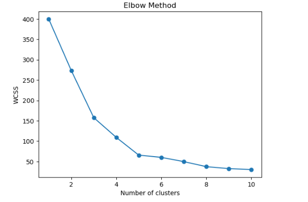
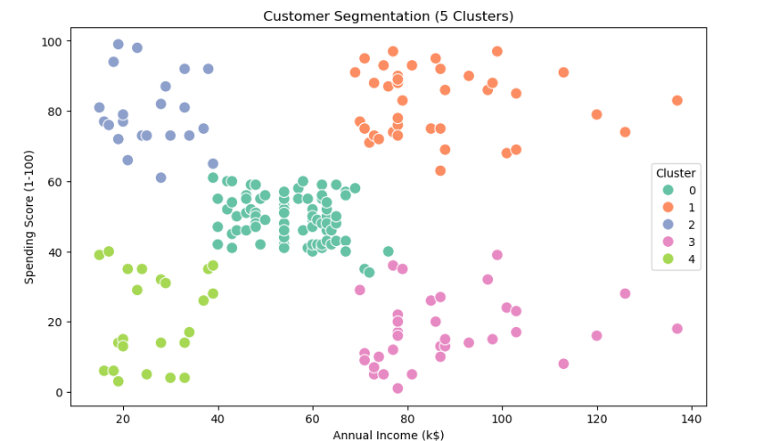

# Customer Segmentation with K-Means Clustering
### Unsupervised Machine Learning for Marketing Analytics

This project applies K-Means clustering to the Mall Customers dataset to identify distinct customer segments based on Annual Income and Spending Score.  
The goal is to support targeted marketing, customer experience optimization, and data-driven business strategy.

---

## Project Objectives

- Identify distinct customer groups based on income and spending behavior  
- Analyze demographic and purchasing patterns  
- Build an unsupervised machine learning model using K-Means  
- Provide actionable insights for business and marketing teams  
- Demonstrate clustering, visualization, and analysis skills in Python  

---

## Tools and Technologies

| Tool / Library | Purpose |
|----------------|---------|
| **Python** | Data analysis and modeling |
| **Pandas / NumPy** | Data preparation and cleaning |
| **Matplotlib / Seaborn** | Visualizations |
| **Scikit-learn** | K-Means clustering and scaling |
| **Jupyter Notebook** | Interactive analysis workflow |

---

## Repository Structure

```
customer-segmentation-kmeans/
│
├── customer_segmentation.ipynb
├── Mall_Customers.csv
├── README.md
│
├── images/
│   ├── elbow_method.png
│   ├── segmentation_plot.png
│   └── cluster_summary.png
│
└── report/
    └── Customer_Segmentation_Executive_Summary.docx
```
---

## Dataset Description

The dataset includes:

- Customer ID  
- Gender  
- Age  
- Annual Income (k$)  
- Spending Score (1–100)  

Clustering was performed using:

- **Annual Income**  
- **Spending Score**  

---

## Data Preparation Steps

1. Loaded and inspected the dataset  
2. Checked for missing values  
3. Selected clustering features  
4. Scaled values using StandardScaler  
5. Prepared feature matrix for K-Means modeling  

---

## Elbow Method – Choosing the Optimal Number of Clusters

The Elbow Method indicated **5 clusters** as the optimal balance.

### Elbow Method Plot  


---

## Customer Segmentation Results (K = 5)

### Segmentation Visualization  


### Cluster Summary Table  


---

## Cluster Interpretations

| Cluster | Description |
|--------|-------------|
| **1** | High income, high spending — premium/VIP customers |
| **3** | High income, low spending — upsell opportunity |
| **0** | Moderate income and moderate spending |
| **2** | Moderate income, high spending |
| **4** | Low income, low spending — budget-sensitive |

---

## Business Insights & Recommendations

- Engage high-value customers (Cluster 1) with loyalty programs  
- Offer budget-friendly promotions for Cluster 4  
- Upsell high-income but low-spending customers (Cluster 3)  
- Tailor marketing strategies to behavioral segments  
- Allocate marketing budgets efficiently using segmentation  

---

## Executive Report

Full business-focused summary:  
**report/Customer_Segmentation_Executive_Summary.docx**

---

## Future Enhancements

- Add demographic features (Age, Gender)  
- Try alternative clustering algorithms  
- Build an interactive Tableau/Power BI dashboard  
- Create customer personas  

---

## Author

**Sahro Haji**  
Data Analytics Student  
GitHub: https://github.com/SHAJI001
