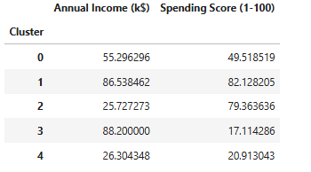

Customer Segmentation with K-Means Clustering
Unsupervised Machine Learning for Marketing Analytics

This project performs customer segmentation using K-Means clustering on the Mall Customers dataset.
The analysis identifies behavioral customer groups based on Annual Income and Spending Score to support targeted marketing, customer experience optimization, and data-driven business strategy.

Project Objectives

Identify distinct customer groups based on income and spending behavior

Analyze demographic and purchasing patterns

Build an unsupervised machine learning model using K-Means

Provide actionable insights for business and marketing teams

Demonstrate clustering, visualization, and analysis skills in Python

Tools and Technologies
Tool	Purpose
Python	Data analysis and modeling
Pandas / NumPy	Data preparation and cleaning
Matplotlib / Seaborn	Visualizations
Scikit-learn	K-Means clustering and scaling
Jupyter Notebook	Analysis workflow
Repository Structure
customer-segmentation-project/
│
├── customer_segmentation.ipynb            # Main Jupyter notebook with code and analysis
├── Mall_Customers.csv                     # Dataset
├── README.md                              # Project documentation
│
├── images/                                # Visual outputs
│   ├── elbow_method.png
│   ├── segmentation_plot.png
│   └── cluster_summary.png
│
└── report/
    └── Customer_Segmentation_Executive_Summary.docx   # Business insights report

Dataset

The dataset contains mall customer information including:

Customer ID

Gender

Age

Annual Income (k$)

Spending Score (1–100)

Clustering was performed using:

Annual Income (k$)

Spending Score (1–100)

Data Preparation

Steps performed:

Loaded and reviewed the dataset

Checked for missing values

Selected clustering features

Scaled features using StandardScaler

Prepared the data matrix for K-Means modeling

Elbow Method (Determining Optimal Clusters)

The Elbow Method suggested five clusters as the optimal balance between compactness and separation.

Elbow Method Plot

Customer Segmentation Results (K = 5)

The K-Means model identified five meaningful clusters based on income and spending behavior.

Segmentation Visualization

Cluster Summary Table

Interpretation of Clusters

Cluster 1: High income, high spending — premium/VIP customers

Cluster 3: High income, low spending — potential upsell segment

Cluster 0: Moderate income and moderate spending

Cluster 2: Moderate income, high spending — value-driven customers

Cluster 4: Low income, low spending — price-sensitive segment

Business Insights and Recommendations

High-value customers should be engaged with loyalty programs and exclusive offers

Low-spending customers may respond to targeted promotions and personalized campaigns

High-income but low-spending customers could be upsold through tailored product bundles

Marketing strategies should differentiate customers by behavior, not only income

Segmentation enables more efficient marketing budget allocation

Executive Report

A comprehensive report summarizing key findings and recommendations is available:

report/Customer_Segmentation_Executive_Summary.docx

Future Enhancements

Add demographic features (Age, Gender, Tenure) to improve segmentation

Experiment with advanced algorithms (DBSCAN, Gaussian Mixture Models)

Deploy a Power BI or Tableau dashboard for interactive customer exploration

Build customer personas based on cluster behavior

Author

Sahro Haji
Data Analytics Student
GitHub: https://github.com/SHAJI001